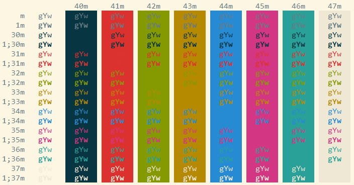
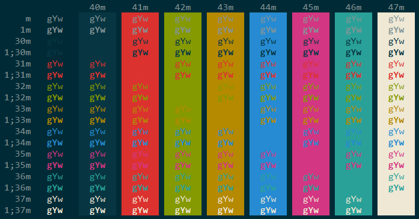

# Pretty PuTTY
Make PuTTY pretty and apply modern PuTTY settings.

## Installation
1. Download one of the .reg files found in this repository.
1. Open the downloaded file in a text editor.
1. Replace `FOO%20BAR` with the PuTTY session name you would like to modify.
1. Save your edit.
1. Double click the .reg file.
1. You're done! Launch the PuTTY session you modified to see how it looks.

## Screenshots

  
*Light color scheme*

   
*Dark color scheme*

## Features
* Solarized color scheme
* 256 color support
* UTF-8 character support
* Consolas 12pt ClearType font
* Linux style copy-and-pasting (middle click to paste)
* Scrollback buffer set to 2000 lines
* Seconds between keepalives set to 59
* Mouse pointer hides while typing
* Initial window size set to 80x40

## Thanks
* to Ethan Schoonover and everybody that contributed to [solarized PuTTY]
(https://github.com/altercation/solarized/tree/master/putty-colors-solarized).
* to Jeff Blaine and everybody that contributed to [modern PuTTY defaults]
(https://github.com/jblaine/solarized-and-modern-putty).
